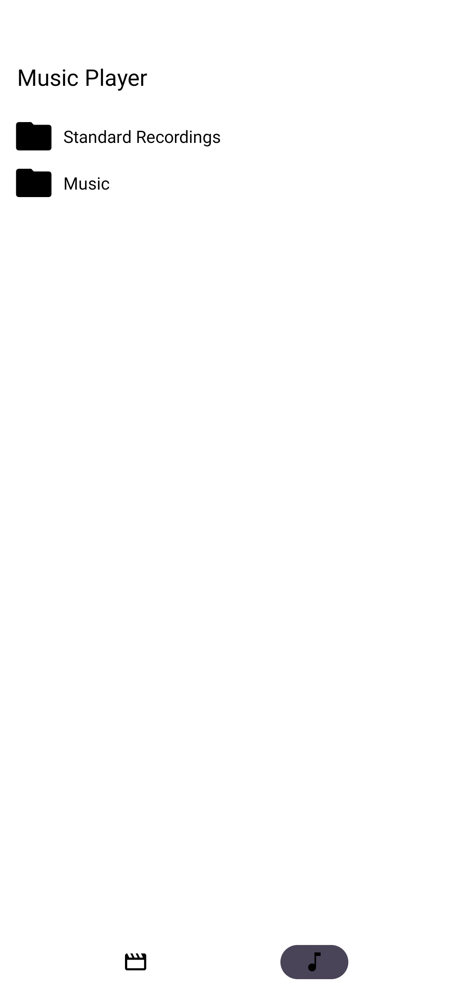
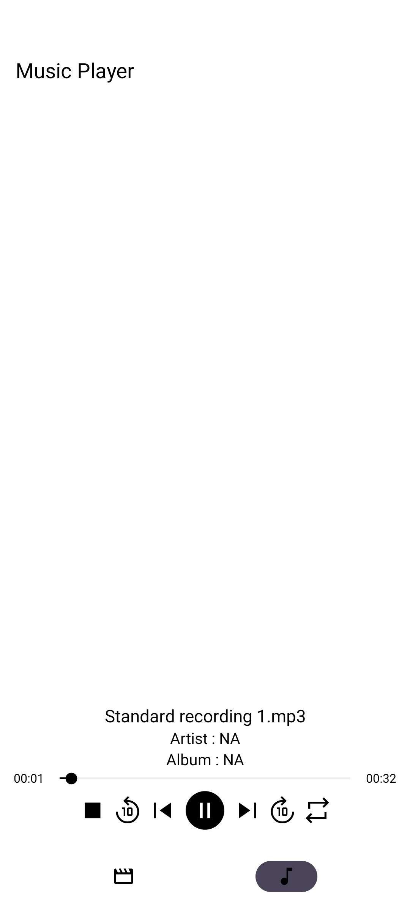
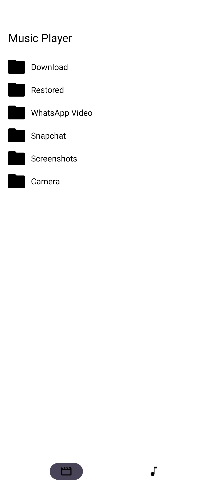
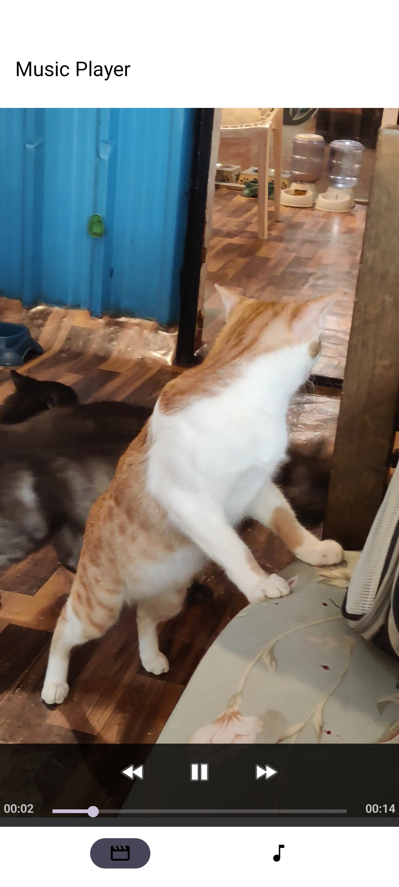

# Music-Player
Music Player android app to play video and audio files. (Background play not supported.)

## Project Setup
1) Android Studio (> Giraffe)
2) Target SDk : 35
3) Java Version : 17
4) Gradle Version : 8.7

## Demo
Audio Folders View  
  
Audio Player View 
  
Video Folder View 
  
Video Player View 
